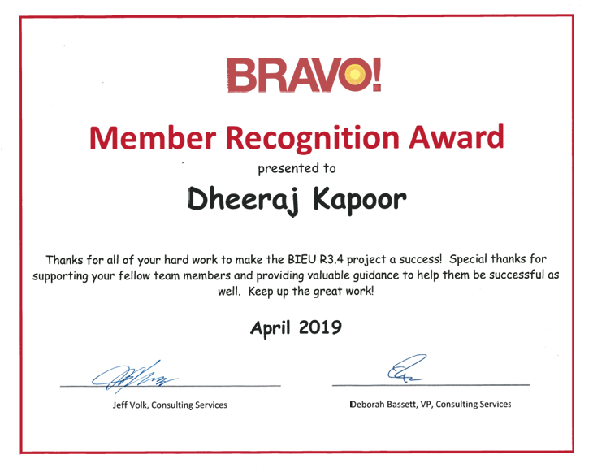
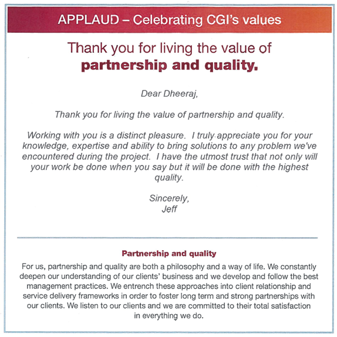
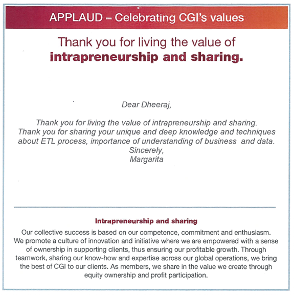

# Dheeraj Kapoor

**Senior System Analyst | Full Stack Developer | Solution Architect**  
📍 Edmonton, Alberta, Canada  
🎓 M.Eng – <a href="https://www.ualberta.ca/en/index.html" target="_blank">University of Alberta</a> | B.Eng – <a href="https://www.dcrustm.ac.in/" target="_blank">DCRUST</a>  
📧 <a href="mailto:dheeraj.kapoor@live.com" target="_blank" rel="noopener">dheeraj.kapoor@live.com</a> | 🌐 <a href="https://www.linkedin.com/in/dheerajkapoor/" target="_blank" rel="noopener">LinkedIn</a>

---

## 🧠 Summary

Experienced technology professional with over 14 years of expertise in application development, systems and data analysis, DevOps, and cloud-based solutions. Proven ability to deliver scalable, high-impact, and maintainable software across both public (Government of Alberta) and private sectors, including banking, telecommunications, and insurance. Skilled in modern web technologies such as Angular, NestJS, Node.js, MongoDB, and GraphQL, with deep experience in cloud platforms like Azure and AWS. Adept at implementing CI/CD pipelines and driving cloud-native application development. Recognized for a strong passion for modern web architecture, building scalable systems, and leading cross-functional teams to create solutions that empower both development teams and end-users.

---

## 🛠️ Skills

- **Languages:** TypeScript, JavaScript, Java, Python, SQL, C#, VBA
- **Frontend:** Angular, HTML/CSS, GoA Design System, Material Design
- **Backend:** NestJS, Express, Node.js, GraphQL, Apollo, REST APIs
- **Databases:** MongoDB, MS SQL Server, CosmosDB, MySQL
- **DevOps & Cloud:** GitHub Actions, Jenkins, Azure, AWS, OpenShift, Docker, Kubernetes
- **Monitoring:** Azure App Insights, OpenTelemetry
- **ETL/BI:** SSIS, SSRS, SSAS, Power BI, ADF
- **Other:** Agile, Git, TFS, Nx, Microservices, CI/CD, Test Automation

---

## 🧩 Projects

  

    <strong>16. Online claims reimbursement (OCR)</strong> —  
    FSD + Architect | Government of Alberta - Edmonton | Apr 2025 – Present
  

  <ul>
    <li>Scaffold application UI & backend using NX, Angular, NestJS and GoA Design System.</li>
    <li>Integrate authentication with alberta.ca Identity provider.</li>
    <li>Implement common application version control using semantic version and build timestamp.</li>
    <li>Implement common application logging and monitoring using Azure App Insights and OpenTelemetry.</li>
  </ul>

  

    <strong>15. FSCD Case Management (Invoice/Payments)</strong> —  
    FSD + Architect | GoA - Edmonton | June 2024 – Present
  

  <ul>
    <li>Designed and implemented an end-to-end workflow for processing invoices and submitting payment requests to 1Gx (GoA Financial System) for disbursement.</li>
    <li>Integrated with 1Gx to retrieve Business Partner information and utilize the Financial Document Search and Post APIs.</li>
    <li>Utilized Azure Service Bus to handle asynchronous operations and ensure reliable background processing.</li>
    <li>Employed NGXS for state management to efficiently handle application state and data flow.</li>
    <li>Implemented a feature flag mechanism to manage feature rollouts, including UI-level hiding and API-level protection.</li>
    <li>Developed dynamic, responsive user interfaces using Angular and the GoA Design System to enhance the user experience.</li>
    <li>Integrated Azure Application Insights with OpenTelemetry for real-time API performance monitoring and proactive error troubleshooting.</li>
    <li>Built traceable transaction workflows with comprehensive logging and monitoring for full auditability.</li>
    <li>Managed CI/CD pipeline using GitHub Actions for automated build and deployment workflows.</li>
    <li>Regularly performed library and dependency updates, addressing GitHub security alerts promptly.</li>
    <li>Continued best practices from previous projects: Angular, NestJS, MongoDB, GraphQL, and reusable shared services.</li>
    <li>Maintained high code quality through automated unit tests (Jest) and end-to-end tests (Cypress).</li>
  </ul>

  

    <strong>14. FSCD Intake</strong> —  
    Full Stack Developer (Tech Lead) | Government of Alberta - Edmonton | Feb 2023 – June 2024
  

  <ul>
    <li>Developed FSCD Intake application to enable Albertans to apply for Family Support for Children with Disabilities (FSCD) benefits.</li>
    <li>Designed and built responsive user interfaces using Angular, GoA Design System, HTML, SCSS, and TypeScript.</li>
    <li>Applied smart & presentational component architecture for maintainable and scalable front-end design.</li>
    <li>Built backend services using NestJS with GraphQL for efficient data handling and manipulation.</li>
    <li>Integrated MongoDB for storing application data, and Apollo Client for cache management.</li>
    <li>Reused shared services for email and SMS notifications via Alberta Notify API, leveraging Bull queues and Redis.</li>
    <li>Integrated with DIMG API for document management and provider data retrieval.</li>
    <li>Enhanced application with system banners (maintenance and notifications) for real-time user updates.</li>
    <li>Contributed to CI/CD pipelines using GitHub Actions and OpenShift for smooth deployment cycles.</li>
    <li>Actively participated in UX workshops to align application design with user needs.</li>
    <li>Developed automated tests: unit tests using Jest and end-to-end tests with Cypress.</li>
    <li>Used Git for source control, integrated with CI/CD workflows for efficient collaboration.</li>
  </ul>

  

    <strong>13. Funeral Benefits</strong> —  
    Full Stack Developer | Government of Alberta - Edmonton | May 2022 – Feb 2023
  

  <ul>
    <li>Developed a Funeral Benefits application to allow Albertans to apply for funeral benefits for deceased cremation and related services using Angular (SPA).</li>
    <li>Designed and implemented user interaction screens with HTML, CSS, Material Design, TypeScript, and Angular for a responsive and intuitive UI.</li>
    <li>Utilized Angular Router for efficient navigation across views during the application process.</li>
    <li>Worked with Angular directives, services, templates, events, and injectors to manage logic and presentation.</li>
    <li>Applied smart & presentational component design pattern for modular and maintainable view architecture.</li>
    <li>Built backend services using NestJS and GraphQL for structured data querying and mutation.</li>
    <li>Integrated MongoDB for efficient data storage and retrieval.</li>
    <li>Created shared services for email and SMS notifications using Alberta Notify API, NestJS, Bull queues, and Redis.</li>
    <li>Integrated with DIMG API to support document uploads and provider data retrieval.</li>
    <li>Enhanced the file server to accommodate additional file types for various document needs.</li>
    <li>Implemented system-wide banners for maintenance notifications and user alerts.</li>
    <li>Contributed to CI/CD pipeline development using GitHub Actions and OpenShift for seamless deployment.</li>
    <li>Utilized Git for version control and integrated it into CI/CD workflows.</li>
    <li>Participated in UX and service design workshops to continuously improve application usability and experience.</li>
    <li>Developed unit tests with Jest and end-to-end (e2e) tests using Cypress to ensure application reliability.</li>
    <li>Leveraged Angular CLI, Git CLI, and VS Code to streamline and enhance development productivity.</li>
  </ul>

  

    <strong>12. AISH & IES Intake</strong> —  
    Full Stack Developer | CGI - Edmonton | Sep 2020 – Apr 2022
  

  <ul>
    <li>Responsible for creating efficient design and developing User Interaction screens using HTML, CSS, Material Design, TypeScript, and Angular (SPA – Single Page Application).</li>
    <li>Implemented Angular Router to enable seamless navigation between views as users perform application tasks.</li>
    <li>Applied Angular directives, controllers, filters, services, templates, events, and injectors to manage application logic.</li>
    <li>Utilized the smart & presentational component design pattern for scalable and maintainable view architecture.</li>
    <li>Developed backend services in Node.js using NestJS and used GraphQL for efficient data querying and manipulation.</li>
    <li>Managed application data storage with MongoDB and used Apollo Client for cache management.</li>
    <li>Initially implemented the web application on AWS cloud infrastructure (Lambda, S3, DynamoDB) and later migrated it to on-prem OpenShift infrastructure.</li>
    <li>Contributed to migrating the application from AWS to on-prem OpenShift with the team.</li>
    <li>Built and maintained CI/CD pipelines using Jenkins and OpenShift for smooth and continuous deployment.</li>
    <li>Used Git for version control and integrated it into the CI/CD pipeline for efficient collaboration.</li>
    <li>Actively participated in workshops with UX and service designers to develop and improve services offered under the COMPASS program.</li>
    <li>Developed automated unit tests using Jest and end-to-end (e2e) tests with Cypress to ensure application reliability.</li>
    <li>Leveraged Angular CLI and Git CLI for enhanced developer productivity, with VS Code as the IDE for efficient development.</li>
  </ul>

  

    <strong>11. Application Maintenance and Support</strong> —  
    Full Stack Developer | CGI - Edmonton | Aug 2018 – Aug 2020
  

  <ul>
    <li>Used client-side scripting languages such as TypeScript, JavaScript, and JQuery to support and maintain web applications (SPA).</li>
    <li>Utilized TypeScript to build and support backend services based on Node.js and Express.</li>
    <li>Developed automated unit tests for web applications using Jasmine and regression tests using Cypress.</li>
    <li>Built and maintained CI/CD pipelines using Jenkins and Docker for continuous integration and deployment.</li>
    <li>Used VS Code for web application development and Visual Studio for Business Intelligence (BI) development work.</li>
    <li>Managed version control using Git for web applications and TFS for BI applications.</li>
    <li>Leveraged Angular CLI to initialize, scaffold, and maintain Angular applications.</li>
    <li>Developed custom directives and pipes for validation and custom formatting rules.</li>
    <li>Provided feedback and collaborated in finalizing reporting requirements.</li>
    <li>Enhanced the frontend of MS Access-based applications using VBA.</li>
    <li>Migrated the backend of several MS Access applications to SQL Server 2016 for improved performance, reliability, and security.</li>
    <li>Assisted clients in connecting and developing reports in MS Excel using SSAS cubes and/or direct database tables.</li>
    <li>Provided consultation on technical challenges in day-to-day operations.</li>
    <li>Assisted and coached business users in processing MS Excel files using Power Query in Power BI.</li>
    <li>Automated data cleanup tasks in MS Excel using VBA programming.</li>
  </ul>

  

    <strong>10. Fort McMurray Wildfire Inappropriate Payment</strong> —  
    Full Stack Developer | CGI - Edmonton | July 2016 – Oct 2016
  

  <ul>
    <li>Developed SSIS packages to load data from Excel spreadsheets received from third-party disbursement agencies (e.g., Red Cross, Select Core).</li>
    <li>Merged and validated data from various sources, ensuring key data attributes matched against identity databases.</li>
    <li>Applied analytics to both completed and pending payments to detect potential fraud.</li>
    <li>Developed SSRS reports as a frontend tool for business users to verify claims.</li>
  </ul>

  

    <strong>9. Business Intelligence Environment Upgrade (BIEU)</strong> —  
    Full Stack Developer | CGI - Edmonton | Feb 2016 – Aug 2018
  

  <ul>
    <li>Prepared and documented business models, rules, and requirements.</li>
    <li>Translated business requirements into conceptual and physical data models in Power Designer (PD).</li>
    <li>Created data lineage to capture data flow and loaded metadata into Power Designer for business context.</li>
    <li>Assisted in developing a roadmap for integrating ministry applications into the BIEU.</li>
    <li>Utilized Agile methodologies to ensure effective project management and delivery.</li>
    <li>Used Master Data Services to validate data before loading it into the Data Warehouse.</li>
    <li>Developed templates and business processes to capture BI environment metadata and loaded them into Power Designer.</li>
    <li>Designed and set up a data cleanup process using Data Quality Services (DQS).</li>
    <li>Developed and designed SSIS framework to load data from EDB (SQL Server 2008) to a new data mart (EDM - SQL Server 2012).</li>
    <li>Used a modular design pattern to create pluggable SSIS packages.</li>
    <li>Prepared an implementation plan for ETL deployment and an operational manual for the AMS team.</li>
    <li>Mentored a team of six on ETL (SSIS) development through knowledge transfer sessions and created SSIS tutorials for further learning.</li>
    <li>Designed and developed new reports and converted legacy COGNOS reports to SSRS.</li>
    <li>Gathered requirements and developed two SSAS cubes for the Family Supports for Children with Disabilities (FSCD) business area.</li>
    <li>Gathered requirements and developed three SSAS cubes for the Client Program and Services (CPS) business area.</li>
    <li>Used MS Power View with OLAP cubes to support ad-hoc data analysis, exploration, and visualization.</li>
    <li>Created BIEU data marts using dimensional modeling.</li>
    <li>Applied star, snowflake, or hybrid schema as required.</li>
    <li>Created and maintained the physical data model (PDM) in SAP Power Designer.</li>
    <li>Published and maintained user access to reports on SharePoint.</li>
    <li>Set up Kerberos authentication to securely authenticate users.</li>
    <li>Created reports and dashboards for SSAS cubes in PerformancePoint (SharePoint).</li>
    <li>Created SSIS/SSAS/SSRS solutions in Visual Studio and used TFS for source control.</li>
    <li>Developed and executed System Integration Testing (SIT) to test data flows between source systems and EDB (Enterprise Database), and between EDB and EDM (Data Warehouse).</li>
  </ul>

  

    <strong>8. Employee Leave Management System</strong> —  
    Full Stack Developer | GoA - Edmonton | Aug 2015 – Sept 2015
  

  <ul>
    <li>Coordinated with the business owner and external vendors to analyze the product prototype.</li>
    <li>Participated in finalizing business requirements and identifying scope of expansion to all ministries in the Government of Alberta.</li>
    <li>Developed and secured the application using form-based authentication with HTML, AngularJS (SPA), JavaScript, CSS, and Node.js (Express).</li>
    <li>Implemented XML and JSON parsing for handling data from other applications.</li>
    <li>Prepared source-target database mapping and defined business rules for data migration.</li>
    <li>Created User Acceptance Test (UAT) plans and identified high-level test scenarios.</li>
  </ul>

  

    <strong>7. Real Estate Capital Asset Priority Planning (ReCAPP) Replacement</strong> —  
    FSD | GoA - Edmonton | May 2014 – Aug 2015
  

  <ul>
    <li>Prepared strategy for data mapping from old facilities capital planning and management software (ReCAPP) to VFA system.</li>
    <li>Analyzed the source ReCAPP database and identified data clean-up strategy and data migration business rules.</li>
    <li>Prepared Data Clean-up, Migration, and Validation strategy documents.</li>
    <li>Used Data Management Tool (DMT) for data extraction and VBA in MS Excel for data transformation.</li>
    <li>Coordinated clean-up tasks with business users and developed SQL scripts to upload data in a timely manner.</li>
    <li>Performed detailed field-to-field data migration validation for over a million records with numerous data fields by compiling source and target data based on data mapping and migration rules.</li>
    <li>Prepared Data Model for Reporting and developed custom reports using Vendor's (VFA) Report Author tool (Cognos BI).</li>
    <li>Prepared Data Model, developed Data Warehouse for historical data, and migrated data to SQL Server 2012 using SSIS packages (DTS).</li>
    <li>Developed BI reports using SSRS and Visual Studio 2013 on historical data, populated using complex T-SQL queries and stored procedures.</li>
    <li>Prepared spreadsheets for populating additional fields in VFA using VBA programming.</li>
    <li>Developed SQL scripts to extract data from the database for testing purposes.</li>
    <li>Prepared business process flow diagrams using MS Visio in preparation for User Acceptance Testing (UAT).</li>
    <li>Conducted Functional System Testing, User Acceptance Testing, and Post-Implementation Verification on the VFA SaaS application to validate customization, business process workflows, and custom reports.</li>
  </ul>

  

    <strong>6. Online Parking Request and Administration</strong> —  
    Full Stack Developer | GoA - Edmonton | Sept 2013 – Apr 2014
  

  <ul>
    <li>Performed data analysis using VBA programming in Excel and cleaned up multiple sources of parking information.</li>
    <li>Conducted database tuning, performance monitoring, and managed user access on MS SQL Server 2008.</li>
    <li>Maintained all databases required for development, testing, and production environments.</li>
    <li>Developed SQL Server Stored Procedures, Functions, and Views to support application development.</li>
    <li>Established standards to ensure synchronization across all environments (development, testing, and training).</li>
    <li>Coordinated with the Human Resources department for the Employee Payroll Deduction Interface and with Service Alberta for the IMAGIS to Infrastructure server Interface.</li>
    <li>Supported business user queries by explaining the OPRA workflow.</li>
    <li>Created dynamic Excel workbooks to track change requests and UAT outcomes.</li>
    <li>Designed data models for reports and developed reports using SQL Server Reporting Services (SSRS) in Visual Studio 2010.</li>
    <li>Prepared training data and facilitated UAT coordination between business users and developers.</li>
  </ul>

  

    <strong>5. Population Research Laboratory</strong> —  
    Analyst | University of Alberta - Edmonton | Apr 2013 – Aug 2013
  

  <ul>
    <li>Collected data on a wide variety of topics including healthcare, education, and other social science research.</li>
    <li>Conducted surveys and gathered information from respondents over the phone using a computer.</li>
    <li>Generated reports, performed data analysis, and submitted results to the research director.</li>
  </ul>

  

    <strong>4. Application Support</strong> —  
    Software Developer | Alberta Blue Cross - Edmonton | May 2011 – May 2012
  

  <ul>
    <li>Performed impact analysis of redesigning and performance enhancement of MS Access-based legacy system.</li>
    <li>Developed and integrated three MS Access-based legacy systems using VBA (Life, Weekly Indemnity, and Long-Term Disability).</li>
    <li>Responsible for stakeholder interviews and Joint Application Development (JAD) sessions for creation and maintenance of BRD using MS Word and Visio.</li>
    <li>Coordinated User Acceptance Testing (UAT) efforts including defining test strategy, development of test plans, and test scripts.</li>
    <li>Gave presentations to the team on a monthly basis, updating them about the progress of the project and rationalizing action plans.</li>
    <li>Managed ongoing work requests using Oracle Forms and Oracle Reports.</li>
  </ul>

  

    <strong>3. Application Support</strong> —  
    Software Developer | Infosys - Pune |  Jan 2010 – Aug 2010
  

  <ul>
    <li>Successfully migrated data between different heterogeneous sources such as flat files, Excel, and SQL Server 2005 using SSIS Bulk Insert and other tasks (DTS).</li>
    <li>Assisted in production of OLAP cubes, wrote queries to produce reports using SQL Server 2008 Analysis Services (SSAS) and Reporting Services (SSRS).</li>
    <li>Developed SQL Server Integration Services (SSIS) packages to transform data from SQL 2005 to MS SQL 2008 and created interface stored procedures used in SSIS to load/transform data to the database.</li>
    <li>Designed and created report templates, bar graphs, and pie charts based on financial data.</li>
    <li>Developed stored procedures and queries to populate data in reports.</li>
    <li>Created reports from Web Services and used MDX on Cubes in SSAS to create reports in SSRS.</li>
    <li>Designed SSRS reports with sub-reports, dynamic sorting, defining data sources, and subtotals for the report.</li>
  </ul>

  

    <strong>2. Application Support</strong> —  
    Software Developer | Infosys - Pune | Feb 2009 – Dec 2009
  

  <ul>
    <li>Developed the Reports module of the project on MS SQL Server 2005, using SSRS, T-SQL, scripts, stored procedures, and views.</li>
    <li>Created tables and loaded data from various sources, such as OLEDB and flat files, into the SQL Server database using SSIS Packages (DTS), and created data mappings for the ETL process.</li>
    <li>Utilized Lookup Transformations to retrieve data from reference datasets.</li>
    <li>Delivered enterprise-level, web-enabled reporting using SQL Server Reporting Services (SSRS) to generate reports from multiple data sources.</li>
    <li>Designed and developed reports based on user requirements using MS Reporting Services 2005.</li>
  </ul>

  

    <strong>1. Application Development</strong> —  
    Software Developer | Infosys - Pune | Nov 2007 – Feb 2009
  

  <ul>
    <li>Implemented frontend of desktop-based Centrasite application in Java using Standard Widget Toolkit (SWT).</li>
    <li>Implemented JAXR (Java API for XML-based registry) to provide UDDI V3 support.</li>
    <li>Developed stored procedures and views using T-SQL to populate data into the frontend.</li>
    <li>Built test cases and performed Unit, Integration, Stress, and Load testing.</li>
    <li>Increased the number of automated unit tests from 50+ to 300+ to improve the overall quality of the application.</li>
  </ul>

---

## 📜 Certifications

- **Microsoft Certified Professional (Power BI, SQL Server)**
- **ITIL V3 Foundation**
- **Certified Associate in Project Management (CAPM)**
- **Sun Certified Java Programmer (SCJP)**

---

## 🏅 Awards and Recognitions

I’ve had the privilege of being recognized for my contributions through various awards:

  
<strong>Bravo Award</strong>

  
  
Received for exceptional team collaboration and delivery excellence.

  
<strong>Applaud Recognition</strong>

  
  
Awarded for outstanding contribution to project development.

  
  
Recognized for mentorship and team collaboration.

---

## ⭐ Testimonials

"Thanks for being such an exceptional professional, Dheeraj. Thanks for always going the extra mile to make sure your team is on track and thriving.
Its a pleasure working with you and we hope it continues."
— Lotanna

"Will miss you Dheeraj! It was great working with you and wish you all the best! Hope to work with you again!" ❤️
— Geeta Daniel

"Been good working with you Dheeraj. I hope you come back soon."
— David Kerins

"Thank you for being such a great part of the team... truly inspiring. We will miss you and hope this is just a ‘see you later’."
— Antarpreet

"We'll truly miss your presence and leadership on our team. Wishing you all the best!"
— Job Delos Santos

"Sometimes I think Dheeraj is AI. You do so much work man!" 🤖🔥
— Sam Merchant

"Thanks for sharing code and KT for balance calculations... Looking at the code, it looks good to me. I know it's challenging — great work!"
— AlexK

---

## 🌱 Interests

• Modern Web Architecture • App Modernization • CI/CD Automation • Scalable Systems • Mentorship & Team Collaboration

---

## 🌐 Find Me Online

- [LinkedIn (Dheeraj Kapoor)](https://www.linkedin.com/in/dheerajkapoor/) — Connect for professional networking, recommendations, and endorsements.
- [Email](mailto:dheeraj.kapoor@live.com) — For consulting, collaboration, or freelance opportunities.

---

## 📣 Call to Action

**Looking for a Senior Full Stack Developer, Solution Architect or Tech Team Lead for your next big project in Edmonton, Alberta or remotely?** Let’s connect and build something impactful together!

<a href="Dheeraj_Kapoor_Resume.docx" download>Resume (MS Word)</a>

**Note:** Kindly refrain from spamming.
